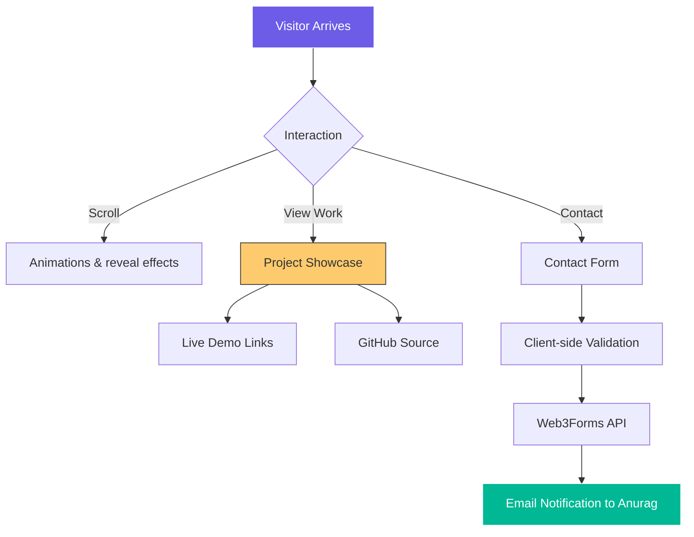

# 🚀 Anurag Kodge | Full-Stack Developer Portfolio

<div align="center">
  
  
  
</div>

<br />

Welcome to my professional portfolio! This repository showcases my journey as a Full-Stack Developer, featuring my projects, skills, and experience in building scalable web applications.

## 🌐 Live Demo
Check out the live version here: **[kodge0001.github.io/Anuragportfolio](https://anuragportfolio-six.vercel.app/)**

---

## 🛠️ System Architecture & Workflow

Below is a high-level overview of how visitors interact with this portfolio and how it handles communications:



---

## ✨ Features
- **💎 Premium UI/UX**: Dark-themed aesthetic with smooth reveal animations.
- **⚡ Dynamic Hero**: Interactive particle background and typing effects.
- **📱 Fully Responsive**: Optimized for all devices using CSS Grid/Flexbox.
- **📂 Deep Integration**: Cloned sub-repositories for easy source code exploration.
- **📬 Seamless Contact**: Backend-less email integration via Web3Forms.

## 🛠️ Tech Stack
- **Frontend**: `HTML5`, `CSS3 (Vanilla)`, `JavaScript (ES6+)`
- **Backend**: `Python`, `Flask` (Local Dev)
- **APIs**: `Web3Forms`, `Intersection Observer`
- **Design**: `Google Fonts (Outfit)`, `Glassmorphism`

## 🚀 Getting Started
1. **Clone the repo**:
   ```bash
   git clone https://github.com/Kodge0001/Anuragportfolio.git
   ```
2. **Run locally**:
   - Open `index.html` directly in your browser.
   - Or run the Flask server:
     ```bash
     python server.py
     ```

## 📧 Let's Connect
<div align="left">
  <a href="mailto:anuragkodge@gmail.com"></a>
  <a href="https://www.linkedin.com/in/anurag-kodge/"></a>
  <a href="https://github.com/Kodge0001"></a>
</div>

---
*Crafted with ❤️ by Anurag Kodge*
